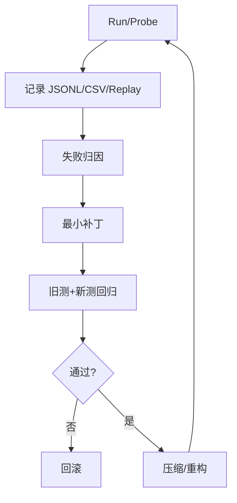
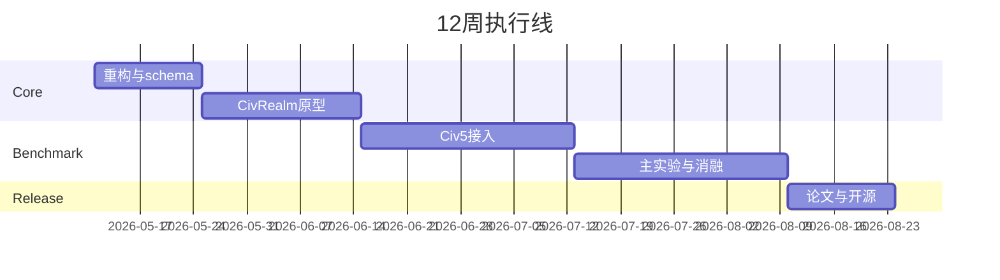

# 面向 / 4X 基准的 Heuristic Learning 研究策略

## 执行摘要

核心判断：应把 urllearning-beyond-gradients 仓库turn0search0 与 urlLearning Beyond Gradients 博文turn0search1 当作**闭环工件协议**，而不是可直接迁移到 4X 的通用框架。它已经给出可复用的循环：`probe→state detector→policy→episodes→trials.jsonl/summary.csv→视频/曲线→失败分析→代码简化+回归`；Atari57 还把每次 run 规范为 `policy.py / trials.jsonl / summary.csv / sample_efficiency.png / README.md`，并设置 20M 步预算。问题在于：仓库公开了代表性脚本与日志，但 `requirements.txt` 只有 `markdown>=3.5`，运行时却默认你已装好 EnvPool/Atari/MuJoCo 依赖，因此缺少容器、锁定环境与统一 orchestrator。最优研究路线是：**先用 CivRealm/Freeciv 做 Linux 原型，再接 Civ5+Vox Populi+Vox Deorum 做主基准，并用 CivBench 的 turn-level victory probability 作为稠密反馈与主评测。** citeturn1view2turn23view1turn23view3turn1view1turn11view0turn17view0turn18view0turn20view3

核心原始来源：urlVox Deorum 论文turn0search2、urlVox Deorum 仓库turn3search0、urlCivBench 论文turn0search3、urlCivRealm 仓库turn2search1、urlCivAgent 仓库turn25search0、urlVoyagerturn12search2、urlEurekaturn12search3、urlFunSearchturn13search0、urlPIRLturn13search1、urlCode as Policiesturn13search2。citeturn6view0turn20view3turn17view0turn24view0turn12search2turn12search3turn13search0turn13search1turn13search2

## 工件与平台基线

| 维度 | 仓库现状 | 4X 迁移建议 |
|---|---|---|
| 核心工件 | Breakout 脚本含状态检测、trial JSONL、summary CSV；HalfCheetah 含 CEM JSONL；Atari57 含批量 prompt 模板 | 抽象成 `hl4x_core`：adapter、ledger、regression、reporting |
| API 假设 | 黑盒 `reset/step/render/info`，严格禁止读源码/隐藏状态 | Civ5 走 Bridge/MCP；CivRealm 走 Gymnasium；CivAgent 走 Unciv/服务端 API |
| 数据格式 | `trial_record` 聚合 `env_steps/ale_frames/score_mean`；搜索日志记录 `sampled_frames/episodes` | 新增 `TurnSnapshot / DecisionRecord / PatchRecord / TestCase / TrialRecord` |
| 复现缺口 | 仅公开静态工件；无容器；依赖未锁；CI 主要服务博客部署 | 补 Docker/Conda、Windows runner、savegame 回归、schema 校验 |
| LLM 选项 | 原文实验用 `gpt-5.4`；Atari57 强制“刷新 best 后先简化再回归” | 角色分层：强 coder、可替换 strategist、廉价 briefer/critic |

表内判断直接来自仓库脚本、README 与 prompt 模板；其中 Breakout 会累加 `env_steps/ale_frames` 并重写 summary，HalfCheetah 的 `SearchIteration` 明确记录每轮 sampled frames/episodes，Atari57 模板固定黑盒约束、20M 步预算和输出物。citeturn16view1turn16view3turn15view0turn14view4turn8view1turn1view0turn1view2

| 平台 | 建议角色 | 优点 | 主要代价 |
|---|---|---|---|
| CivRealm + entity["video_game","Freeciv","open-source strategy video game"] | 原型/CI | Docker、Gymnasium、同时支持 tensor agent 与 language agent | 与 Civ5 规则不完全同构 |
| Civ5 + Vox Populi + Vox Deorum | 主基准 | 最高生态保真；LLM 只管宏观战略、战术交给子系统 | Windows-only、桥接复杂、运行成本高 |
| CivBench | 评测层 | VP(t) 稠密信号、Simple/Briefed、战略画像 | 主要是评测框架，不是训练环境 |
| CivAgent + entity["video_game","Unciv","open-source Civilization-like strategy game"] | 外交/拟人补充 | 支持谈判、欺骗、data flywheel | 更偏 social/human-like 而非标准策略强度 |

Vox Deorum 的仓库与论文都说明其分层架构是 “LLM 管宏观战略，战术执行委托给子系统”；CivBench 则直接建立在该 strategist 接口上；CivRealm 提供 Gymnasium + 语言 agent 双接口；CivAgent/Unciv 强于外交与人类式交互。citeturn18view0turn6view0turn20view0turn20view2turn17view0turn4view1turn24view0turn24view3

## 研究问题与实验设计

建议聚焦四问：**样本效率**（HL+progress+regression 是否优于 terminal-only HL、纯 strategist、RL）；**泛化与维护**（测试/回放是否降低 forgetting 与 regression failures）；**耦合复杂度**（压缩/重构能否在不降分下控制复杂度）；**宏动作可恢复性**（带 pre/post/failure-recovery 的 playbook 是否改善战争恢复与战略 pivot）。这些问题分别对应博客中的 HS、regression/fixed-seed replay/golden traces、coupling complexity、macro-actions/recoverable state，以及 CivBench 的 VP(t) 与 Simple/Briefed 设计。citeturn22view5turn22view1turn22view0turn22view4turn20view3turn20view2turn6view5

| 比较组 | 主要能力层 | 首要指标 | 关键消融 |
|---|---|---|---|
| Vox Populi/VPAI | 规则战略 | 胜率、VP-AUC | 作为 capability floor / anchor |
| Vox Deorum-Simple | 纯 strategist | VP-AUC、token、wall-clock | 不带 briefer |
| Vox Deorum-Briefed | strategist+briefers | VP-AUC、成本 | 固定弱 briefer |
| CivRealm tensor RL | 端到端 RL | env steps、reward | full-game vs mini-game |
| HL-full | playbook+tests+compression | VP-AUC、regression、复杂度 | 主方法 |
| HL 去掉 progress / regression / compression | 消融 | forgetting、回归失败、维护成本 | 验证各模块必要性 |

实验主设置建议沿用 CivBench 的 8 人、Communitas_79a、默认规则，并额外做 OOD：未见文明、地图脚本、玩家数、可见信息裁剪、版本切换与固定 savegame 回归。指标统一记录 `reward / VP-AUC / env_steps / token cost / wall-clock / code complexity / regression failures / forgetting / test coverage`；复杂度建议用模块数、跨模块 patch 触达数、依赖边数、代码行数/圈复杂度联合度量。CivBench 已证明：307 局、7 个 LLM、23 个状态特征与 turn-level logging 可以刻画战略差异；博客则表明“只增长不压缩”的 HS 会把复杂度推到失控。citeturn20view4turn20view3turn6view3turn20view2turn22view0turn22view3

## 系统与数据规范

```mermaid
flowchart LR
A[Game Adapter]-->B[State Briefer]
B-->C[Router]
C-->D[Playbook Library]
C-->E[Strategist]
D-->F[Action/Patch]
E-->F
F-->G[Evaluator VP(t)/Risk]
G-->H[Regression Harness]
H-->I[Coding-Agent Updater]
I-->J[Compression or Refactor]
J-->D
```

该图把 Vox Deorum 的 strategist 控制面、CivBench 的 briefer 管线、博客的 HS/回归闭环，以及 Voyager 的技能库、Eureka/FunSearch 的 evaluator-guided 更新合并为一个决策图。citeturn18view0turn20view2turn22view5turn12search2turn12search3turn13search0

建议最小 schema：`TurnSnapshot{game_id,turn,civ,visible_state,features23,vp_t}`；`DecisionRecord{turn,tools_called,playbook_id,rationale,tokens}`；`PatchRecord{parent_sha,diff,root_cause,tests_added}`；`TrialRecord{seed,map,civs,turns,VP_AUC,cost,time,code_sha}`；`TestCase{id,savegame,assertions}`。CI 采用“双轨”：Linux 跑 schema/unit/CivRealm `test_civrealm` smoke；Windows 自托管 runner 跑 Civ5 savegame 回归与夜间 benchmark。citeturn4view1turn18view0turn16view1turn15view0

```yaml
id: war_recovery_t30
platform: civ5
setup:
  savegame: saves/war_pivot_t120.Civ5Save
assert:
  - metric: vp_delta_30
    op: ">"
    value: -0.05
  - metric: cities_lost_30
    op: "<="
    value: 1
  - metric: strategy_target
    op: in
    value: [defense, diplomacy]
```

```text
Updater Prompt
输入: 最近K局 summary、失败测试、当前 playbook diff、VP(t) 曲线、预算余额
输出(JSON): {root_cause, minimal_patch, added_tests, expected_gain, rollback_rule}
规则: 先最小补丁；刷新 best 后必须进入简化阶段；未过旧测一律回滚
```



## 实施路线与预算

| 阶段 | 周期 | 工时 | 资源 |
|---|---:|---:|---|
| `hl4x_core` 重构 | 2 周 | 80h | 1 名研究生 |
| CivRealm 原型+HL loop | 3 周 | 120h | Linux 16–32 vCPU，Docker |
| Civ5/Vox 接入 | 4 周 | 160h | Windows 10/11 + Civ5 + API key |
| 大规模实验与消融 | 4 周 | 160h | 1 台 GPU 节点 + LLM API |
| 论文与开源 | 2 周 | 80h | 研究者+0.2FTE 人工审计 |

预算应分层：原型层几乎不需要 GPU，只要 Docker/CPU 即可；主实验至少需要一台 Windows runner，因为 Vox Deorum 明确要求 Windows+Civ5，源码构建还需 Node.js≥20、Python、VS Build Tools、Git LFS；若复用或轻调 CivBench 的 VP 估计器，可用单张 24–48GB GPU。API 费用可按 CivBench 的已报告量级估算：单 strategist 条件从几十到千美元级不等，因此建议原型阶段先用廉价 briefer/critic，full run 再上强模型。citeturn18view0turn4view1turn6view4turn6view3



## 风险、复现与交付

最大风险有四个：Civ5 自动化脆弱、终局奖励稀疏、策略对地图/文明过拟合、HS 复杂度“泥球化”。对应缓解：先在 CivRealm 完成闭环；主评测改用 VP(t)+终局双指标；强制 seen/OOD split 与固定 savegame 回归；每次刷新 best 后必须做 compression，并把 regression/fixed-seed replay/golden traces 作为一等工件。citeturn17view0turn20view3turn22view1turn22view0turn22view3

交付物应包括：代码（adapter、router、playbook、updater、CI）、基准套件（CivRealm 与 Civ5 harness）、数据集（replays/savegames/tests/turn logs）、评测脚本（VP-AUC、成本、复杂度、forgetting）、论文大纲（引言/相关工作/系统/实验/维护成本与耦合复杂度/局限）。复现清单至少锁定：代码 SHA、prompt 版本、模型名与温度、地图脚本、文明池、seed split、savegame 集、CI 配置、token 账本、Windows runner 版本。整体论文题目可定为**“Regression-Tested Compound Strategic Heuristic Systems for Civilization V”**。citeturn23view1turn20view2turn18view0turn22view5